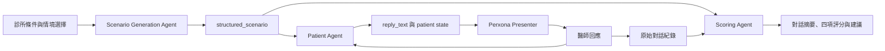
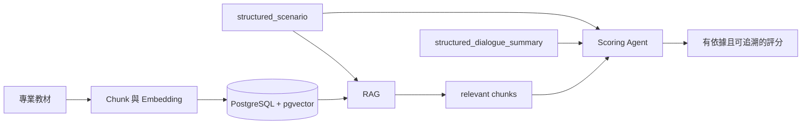

# 診間練習室｜Perxona AI Virtual Patient

為台灣基層診所設計的困難醫療溝通模擬。醫師輸入診所條件並選擇情境後，AI 會即時生成虛構病人與病例背景，再透過 Perxona Avatar 進行對話；完成練習後，系統提供結構化溝通評分與建議。

> 本專案只用於虛構情境與溝通訓練，不提供診斷、處方或治療建議，也不應輸入真實病人個資。

## Demo 重點

- 依診所科別、設備、時間與轉診限制即時生成案例。
- 提供三種困難情境，不使用固定病人腳本。
- Patient Agent 會維持高衝突角色，並依醫師回應逐輪更新信任、焦慮與合作意願。
- Perxona Avatar 將病人回覆轉為語音與自動 motion。
- Scoring Agent 依實際對話證據提供四項評分、主要風險與建議說法。

目前提供三種情境：

1. 不理會醫療建議，卻持續反覆就診。
2. 對醫療照護抱持不切實際的想像與要求。
3. 要求醫師開立不必要的藥物或檢查。

完整產品目標與資料欄位請見 [docs/goal.md](docs/goal.md)。

## 目前 Demo 流程



目前 Demo 不使用 RAG。Scenario、Patient 與 Scoring 三個 Agent 皆透過後端呼叫 OpenAI API 或其他相容 endpoint；瀏覽器不會取得 LLM API key。

## 系統組成

| 元件 | 責任 | 主要位置 |
| --- | --- | --- |
| Hackathon UI | 診所設定、病例預覽、Avatar 對話與評分頁 | `samples/express/public/demos/hackathon/` |
| Express server | 保管金鑰、串接 LLM 與 Perxona API | `samples/express/server.mjs` |
| Agent logic | 三種情境、JSON 正規化、三個 Agent prompt | `samples/express/lib/hackathon.mjs` |
| Perxona Presenter | Avatar、Scene、Voice、語音與自動 motion | `<sv-presenter>` Web Component |
| LLM | 生成病例、扮演病人及進行溝通評分 | OpenAI／OpenAI-compatible API |

### API 資料流

| Endpoint | 輸入 | 輸出 |
| --- | --- | --- |
| `POST /api/hackathon/scenario` | 情境類型、診所條件 | `structured_scenario` |
| `POST /api/hackathon/patient` | scenario、病人狀態、對話紀錄 | 病人回覆、更新狀態、是否適合收尾 |
| `POST /api/hackathon/score` | scenario、原始對話紀錄 | 摘要、四項分數、風險與建議 |

## 快速開始

需求：

- Node.js 22 以上
- Perxona Connect secret key 與 publishable key
- OpenAI API key，或 OpenAI-compatible LLM endpoint

PowerShell：

```powershell
git clone https://github.com/dorianchen0913/perxona-hackathon.git
cd perxona-hackathon\samples\express
Copy-Item .env.example .env
npm install
npm run dev
```

在 `samples/express/.env` 至少設定：

```dotenv
PERXONA_API_BASE_URL=https://console.perxona.ai/asia
PERXONA_CONNECT_SECRET_KEY=your_secret_key
PERXONA_CONNECT_PUBLISHABLE_KEY=your_publishable_key

LLM_PROVIDER=openai
LLM_BASE_URL=https://api.openai.com/v1
LLM_MODEL=gpt-4o-mini
LLM_API_KEY=your_openai_api_key
```

如需固定展示角色，可再設定：

```dotenv
DEMO_FIXED_AVATAR_ID=your_avatar_id
DEMO_FIXED_SCENE_ID=your_scene_id
DEMO_FIXED_VOICE_ID=your_voice_id
```

啟動後開啟：

- Hackathon Demo：<http://localhost:8083/demos/hackathon/>
- Perxona Studio 參考工具：<http://localhost:8083/demos/studio/>

請勿提交 `.env`。所有 secret key 與 LLM API key 都應只保留在伺服器端。

## 評分方式

每項 0–2 分，總分 8 分：

| 評分項目 | 判斷重點 |
| --- | --- |
| 理解病人與隱藏需求 | 是否辨識明確要求背後的擔心與期待 |
| 同理與清楚說明 | 是否回應情緒並提供可理解的說明 |
| 界限與資源運用 | 是否守住專業界限並提供合理替代方案 |
| 合作與下一步 | 是否形成可執行的追蹤或轉診計畫 |

評分只針對溝通表現，不判斷醫療決策正確性。

## 報告方向：加入 RAG

黑客松 Demo 先驗證「生成情境 → Avatar 對話 → 溝通評分」。正式產品可加入經醫療專業審核的知識庫，讓評分依據可維護且可追溯。



RAG、向量資料庫、真實病歷串接及跨場次狀態保存不在目前 Demo 範圍內。

## 測試

```powershell
cd samples\express
npm run test:hackathon
```

## 專案文件

- [完整專案目標與資料架構](docs/goal.md)
- [Hackathon Demo 操作與 API 說明](samples/express/docs/hackathon/LOCAL_LLM_DEMO.md)
- [Perxona Embed 教學](samples/express/docs/hackathon/EMBED_GUIDE.md)
- [人物設定範例](samples/express/docs/hackathon/persona.example.txt)
- [Motion 設定範例](samples/express/docs/hackathon/motions.example.json)

## License

本專案基於 Perxona Connect Kit 開發，沿用 [Apache License 2.0](LICENSE)。
