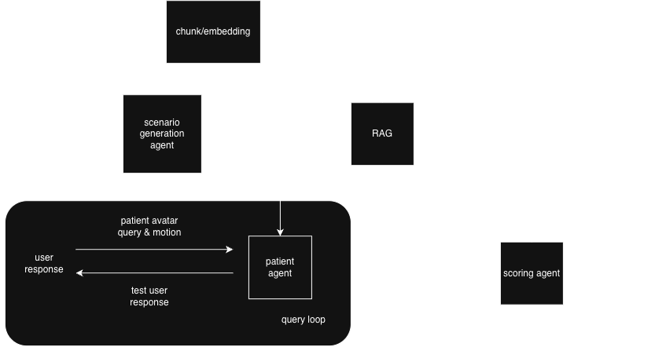

# 專案目標與資料架構

## 1. 一句話形容專案

為台灣基層診所建立可依實際診所條件客製化的 AI 困難醫療情境模擬，讓第一線醫師練習在有限時間、資源與制度限制下，與不同特質與就醫行為的病人建立長期穩定、合作的醫病關係。

## 2. 目標使用者：基層診所的第一線醫師

包含不同科別、需要高頻率與病人直接互動的診所醫師，尤其是經常面對反覆就醫、期待落差、醫療不確定性，以及長期醫病關係管理等挑戰的第一線工作者。

## 3. 想解決的問題

常見的 AI Virtual Patient／Avatar 訓練，多以醫學生或大型醫療機構的教育訓練為主要場景，且著重在單次互動中的病人情緒狀態，例如焦慮、憤怒、抗拒，以及學員是否能正確運用同理、傾聽與降溫溝通技巧。

然而，基層診所面對的困難醫病關係往往不只是單次情緒衝突，而是受到病人的互動特質與醫療期待、醫師的溝通方式、診所資源限制、既有醫療流程，以及台灣醫療制度共同影響。醫師除了說明醫療判斷，也必須處理病人的焦慮、不信任與期待落差。

例如，病人強烈要求接受 CT 檢查，但診所不提供相關服務，或醫療判斷認為需符合特定適應症後才能安排檢查。

因此，我們希望建立可依診所條件客製化的 AI 困難醫療情境模擬。使用者選擇情境並輸入診所條件後，由 Agent 自動生成病人角色、病例背景與互動目標，讓醫師練習如何在有限資源、醫療流程與制度限制下回應病人的需求。

本次實作 Demo 聚焦三種情境：

1. 不理會醫療建議，卻持續反覆就診。
2. 對醫療照護抱持不切實際的想像與要求。
3. 要求醫師開立不必要的藥物或檢查。

## 4. 目前 Demo 的資料設定

### (1) 使用者輸入

使用者先選擇第 3 節所列三種困難情境之一，再填入診所條件。

| 欄位 | 必填 | 用途 |
| --- | --- | --- |
| `specialty_services` | 是 | 診所科別與主要服務 |
| `available_resources` | 是 | 現場可提供的檢查、處置與支援 |
| `unavailable_resources` | 是 | 無法提供或需要轉診的資源 |
| `average_visit_time` | 是 | 每位病人的平均看診時間 |
| `referral_followup` | 否 | 轉診與後續追蹤方式 |
| `situational_pressure` | 否 | 候診人數、即將休診或家屬介入等壓力 |

以上只輸入診所層級資訊，不輸入真實病人的病歷、姓名或其他可識別個資。

### (2) Scenario Generation Agent 輸出

Agent 接收 `scenario_type + clinic_condition`，生成一份虛構的 `structured_scenario`。

| 欄位 | 內容 |
| --- | --- |
| `title` | 本次模擬情境標題 |
| `clinic_condition` | 使用者輸入並經系統正規化的診所條件 |
| `patient_profile` | 顯示名稱、年齡區間、背景、健康識能與說話方式 |
| `current_visit` | 本次主訴、明確要求及與診所條件的衝突 |
| `hidden_need` | 病人未直接說出的焦慮、期待或不信任來源 |
| `interaction_pattern` | 病人的可觀察互動模式，不使用人格疾病標籤 |
| `encounter_history` | 0–2 筆由 Agent 生成的既往就診背景，不是永久病歷 |
| `initial_state` | 信任、焦慮與合作意願，分為低／中／高 |
| `disclosure_rules` | 病人揭露隱藏資訊的條件 |
| `success_criteria` | 本次練習的 2–4 項溝通目標 |
| `scoring_rubric` | 依本次情境生成的四項評分要點 |

生成後，使用者可以預覽病例、返回修改條件或重新生成，再開始 Avatar 對話。預覽畫面不顯示 `hidden_need` 與 `disclosure_rules`。

### (3) Patient Agent 每輪資料

Patient Agent 接收：

- 完整 `structured_scenario`
- 目前的 `state`
- 最多 20 筆醫師與病人的對話紀錄

每輪輸出：

| 欄位 | 內容 |
| --- | --- |
| `reply_text` | 病人的繁體中文口語回覆 |
| `state` | 更新後的信任、焦慮與合作意願 |
| `motion_key` | 目前固定為 `auto`，保留作為未來明確動作控制介面 |
| `should_end` | 病人狀態是否已適合結束對話 |

病人預設呈現較高衝突的互動方式，例如質疑、抱怨、反問或重申要求；只有當醫師回應情緒、合理說明限制並提出可執行下一步後，才會逐輪降低衝突。

### (4) Scoring Agent 輸出

Scoring Agent 接收 `structured_scenario + 原始對話紀錄`，只評估溝通表現，不判斷診斷或治療是否正確。

輸出內容包括：

- 對話經過與病人結果摘要
- 四項分數與評分理由
- 總分（滿分 8 分）
- 本次做得最好的地方
- 主要溝通風險
- 一句可直接參考的建議說法

## 5. 目前 Demo 架構：無 RAG

目前 Demo 使用 OpenAI API 或其他 OpenAI-compatible LLM endpoint，沒有建置向量資料庫或檢索流程。

```text
診所條件 + 三選一情境
→ Scenario Generation Agent
→ structured_scenario
→ Patient Agent 對話迴圈
→ reply_text + patient state
→ Perxona Avatar 語音與自動 motion
→ structured_scenario + 原始對話紀錄
→ Scoring Agent
→ 對話摘要、四項分數與建議
```

### 各元件責任

#### Scenario Generation Agent

- 依診所條件與情境類型生成單一虛構案例。
- 不直接與醫師對話，也不提供診斷或治療建議。

#### Patient Agent

- 依 `structured_scenario` 扮演病人並維持角色一致。
- 遵守 `disclosure_rules`，根據醫師回覆更新病人狀態。
- 只生成病人回覆文字與狀態，不負責評分。

#### Perxona Presenter

- 使用固定的 Avatar、Scene 與 Voice 呈現病人。
- 前端將 `reply_text` 傳入 `presenter.present()`。
- 目前由 Perxona 依文字自動產生語音與動作，Patient Agent 尚未指定個別 Motion ID。

#### Scoring Agent

- 根據原始 scenario、情境專用 rubric 與實際對話證據評分。
- 產生結構化對話摘要、分數、風險與建議說法。

## 6. Demo 操作流程

```text
設定診所條件並選擇情境
→ 生成、預覽或重新生成虛構病例
→ 開始 Perxona Avatar 對話
→ 建議完成 3–5 輪對話
→ 結束並評分
→ 查看溝通摘要、分數與建議
```

單次對話最多保留 20 筆訊息，即醫師與病人合計約 10 輪。重新開始後不保留前一次模擬狀態。

## 7. 目前評分架構

每項 0–2 分，總分 8 分。

| 評分項目 | 判斷重點 |
| --- | --- |
| 理解病人與隱藏需求 | 是否辨識明確要求背後的擔心與期待 |
| 同理與清楚說明 | 是否回應情緒，並以病人能理解的方式說明 |
| 界限與資源運用 | 是否守住專業界限，並提出符合診所資源的替代方案 |
| 合作與下一步 | 是否形成可執行的追蹤、觀察或轉診計畫 |

評分結果必須引用對話中的實際表現，不因醫師單純答應病人要求而給予高分。

## 8. Demo 範圍與報告方向

### 黑客松 Demo 已涵蓋

- 三種固定困難情境選擇
- 六項診所條件輸入
- Scenario Generation、Patient 與 Scoring 三個 Agent
- 病例預覽與重新生成
- Perxona Avatar 對話與自動 motion
- 病人狀態更新與四項溝通評分

### 本階段不做

- RAG、embedding、PostgreSQL 或 pgvector
- 真實病歷、HIS／EMR 串接或病人個資
- 跨場次的長期病歷與狀態保存
- 診斷、處方或治療建議
- Patient Agent 對特定 Motion ID 的明確控制

### 報告中的產品擴充方向



正式產品可加入經醫療專業審核的知識庫，流程分為三條資料線：

1. **情境生成**：診所條件與使用者選擇交給 Scenario Generation Agent，產生 `structured_scenario`。
2. **知識檢索**：專業教材經 chunk、embedding 後存入 PostgreSQL + pgvector；RAG 再依 `structured_scenario` 取得 `relevant_chunks`。
3. **對話與評分**：Patient Agent 依 scenario 進行 Avatar 對話，對話結束後產生 `structured_dialogue_summary`；Scoring Agent 結合摘要與 `relevant_chunks` 輸出分數與回饋。

RAG 用於提供 Scoring Agent 與本次情境相關的溝通原則及評分依據，不直接介入 Patient Agent 的每輪回答，也不控制 Perxona motion。

目前 Demo 尚未實作 RAG 與獨立摘要步驟，而是直接將原始對話紀錄交給 Scoring Agent，並由該 Agent 同時產生摘要與評分。Demo 先以固定 prompt 驗證情境生成、Avatar 互動與評分流程。

## 9. 核心產品差異與 Why Perxona

本專案不是讓使用者手動編寫完整病人設定，而是由 Agent 根據診所條件與所選困難情境即時生成案例。相同的情境類型可以因科別、設備、時間與轉診方式不同，形成不同的病人背景與衝突來源。

Perxona Avatar 將病人回覆轉為可聽見、可觀察的語音與非語言表現，使醫師必須在情境壓力下即時調整回應，而不只是閱讀文字題目。

系統核心可概括為：

**Clinic Context → Scenario Generation → Patient Interaction → Perxona Presentation → Communication Evaluation**

## 10. 團隊仍需完成或確認

1. 確定上台 Demo 使用的診所條件與主要情境。
2. 由醫療專業人員審核三類案例的合理性、紅旗界線與禁止內容。
3. 確認四項評分 rubric 及高、中、低分回答範例。
4. 準備一條穩定的成功對話路徑與備用 Demo 腳本。
5. 確認未來 RAG 教材的使用權、版本與醫療專業審核方式。
